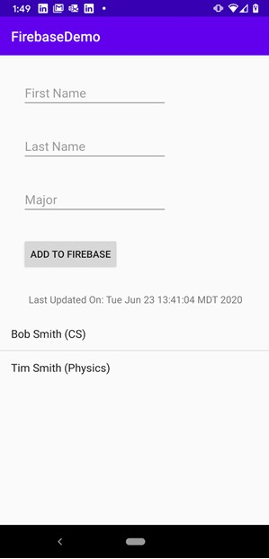
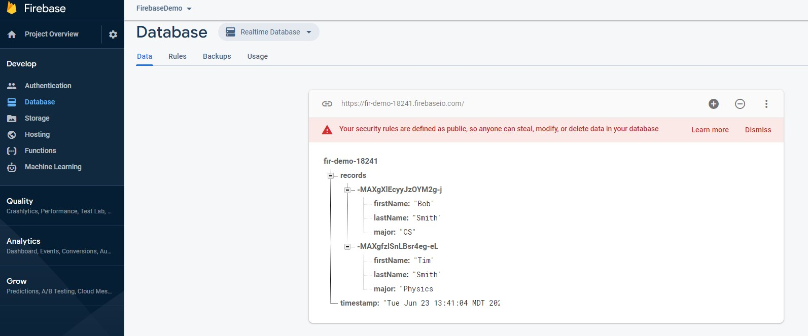

# FirebaseDemo

This example code is intended to demonstrate how to read and wrote from Firebase using Android and Java.

The program will prompt the user to submit a record (first name, last name, major) which will be saved to Firebase. A timestamp will also be stored in Firebase to show the last update time.

The following functions can show you how to use Firebase:
* `addRecord` - Demonstrate the ability to add/update an object to a list in firebase.  This uses the `push` function.
* `updateTimeStamp` - Demonstrate the ability to add/update an object (or in this case a single string value) into firebase (not within a list).
* `registerFirebaseRecordListener` - Demonstrate the ability to read objects from a list in Firebase.  The objects are sent one at a time (when the app first starts and then when something changes).
* `registerFirebaseRecordListener2` - Demonstrate a different way to do the same thing.  In this case, all of the objects from the list are sent at once.
* `registerFirebaseTimestampListener` - Demonstrate how to read a single object from Firebase (not within a list).  

**Screenshot of App**:

**Screenshot of Firebase**

